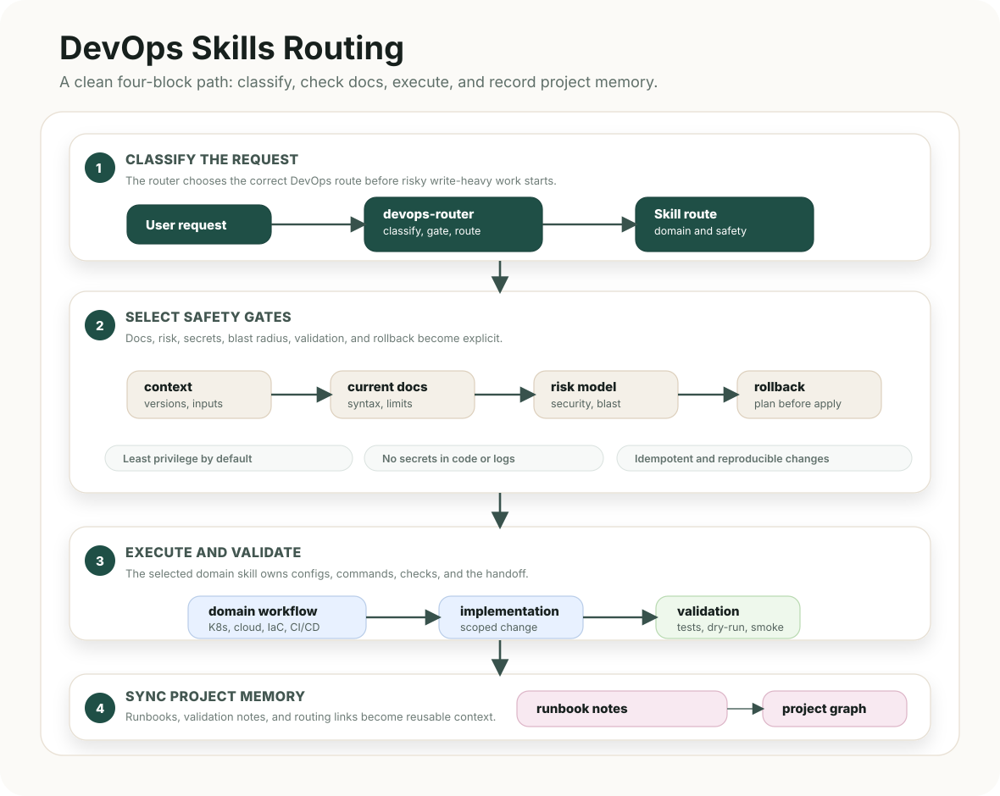

# DevOps Skills

<p align="center">
  <strong>Production-grade DevOps skill routing for Codex, Claude Code, and local agent workflows.</strong>
</p>

<p align="center">
  <a href="devops/docs/README.ru.md">Русский</a>
  |
  <a href="devops/routing/README.md">Routing guide</a>
  |
  <a href="devops/docs/project-memory.md">Project memory</a>
  |
  <a href="DESIGN.md">Design contract</a>
</p>

<p align="center">
  🛡️ safety gates · 🧭 explicit routing · ⚙️ infrastructure workflows · ✅ validation and rollback
</p>

---

## Overview

DevOps Skills is a professional operations skill pack for AI coding agents. It gives Codex, Claude Code, and local agents a safe route from the first infrastructure request to a verified handoff: classify the task, check current docs, choose the right domain skill, implement inside a clear blast radius, validate, and record the outcome.

The repository keeps the root clean and places the working system under one main directory: [`devops/`](devops/).

For production, security-sensitive, or cross-boundary changes, the system applies a principal-level bar: current documentation evidence, explicit decision trace, blast-radius control, least privilege, validation ladder, rollback, and a clean handoff.

## Routing Diagram



## Prerequisites

- Codex, Claude Code, or another MCP-compatible agent environment.
- Context7 MCP configured as `context7`/`mcpcontext7` so agents can fetch current cloud, Kubernetes, IaC, CI/CD, container, security, network, CLI, API, and provider documentation before implementation.
- Access to the target project, platform, or environment required for validation commands and dry-runs.

## Quick Start

```bash
git clone <repo-url>
cd devops-skills
./install.sh --list
./install.sh --global --target all --dry-run
python3 devops/scripts/validate.py
```

Install globally for Codex:

```bash
./install.sh --global --target codex --force
```

Install globally for Claude Code:

```bash
./install.sh --global --target claude --force
```

Install into one local project instead of globally:

```bash
./install.sh --local /path/to/project --target all --force
```

## Installer Flags

| Flag | Meaning |
| --- | --- |
| `--global` | Install into user-level Codex or Claude Code skill directories. |
| `--local PATH` | Install into one project without touching global config. |
| `--target codex` | Install Codex-compatible skills and project rules. |
| `--target claude` | Install Claude Code-compatible skills and rules. |
| `--target agents` | Install only `.agents` project-local skills. |
| `--target all` | Install every supported target for the selected mode. Default. |
| `--copy` | Copy skill folders. Default and most portable. |
| `--link` | Symlink skill folders. Best for local development. |
| `--force` | Replace existing installed copies. |
| `--dry-run` | Print planned actions without changing files. |
| `--list` | List packaged skills. |

Global installation respects environment-specific homes:

| Variable | Used For | Default |
| --- | --- | --- |
| `CODEX_HOME` | Codex global skills. | `$HOME/.codex` |
| `CLAUDE_HOME` | Claude Code global skills. | `$HOME/.claude` |

## Skills

| Skill | Purpose |
| --- | --- |
| `devops-router` | Classifies DevOps requests, selects the skill chain, enforces safe gates, and defines the handoff format. |
| `kubernetes-operations` | Handles manifests, Helm/Kustomize, rollout strategy, storage, networking, RBAC, Pod Security, and cluster troubleshooting. |
| `cloud-operations` | Designs and reviews cloud IAM, VPC/VNet, regions, managed services, HA/DR, migration, and cost/risk control. |
| `observability-operations` | Builds metrics, logs, traces, dashboards, alerts, SLI/SLOs, and production diagnostics. |
| `cicd-automation` | Creates build/test/scan/package/deploy flows, approvals, protected environments, release patterns, and rollback. |
| `scripting-automation` | Writes Bash, Python, and PowerShell automation with safe flags, dry-run behavior, errors, retries, and usage output. |
| `infrastructure-as-code` | Covers Terraform, OpenTofu, Pulumi, CloudFormation, Bicep, ARM, Crossplane, state, imports, plans, and policy checks. |
| `container-platforms` | Handles Docker, BuildKit, Podman, Compose, OCI images, registries, healthchecks, non-root runtime, and image security. |
| `security-secrets` | Designs secret flow, IAM/RBAC hardening, Vault/KMS/SOPS/Sealed Secrets, scanning, SBOM, signing, audit, and rotation. |
| `incident-troubleshooting` | Guides outages, failed deploys, degradation, timelines, hypotheses, recovery, rollback, and prevention notes. |
| `network-vpn-security` | Designs and debugs VPC/VNet, VPN, routing, DNS, firewall rules, ACLs, security groups, private connectivity, hybrid networking, and MTU/latency issues. |

## Routing Model

1. `devops-router` reads the request and classifies the work.
2. The router selects one or more domain skills.
3. The chosen skills require Context7 MCP documentation checks before platform-specific code or configuration.
4. High-risk work follows the principal-level operating model before write-heavy changes.
5. Implementation stays scoped to the selected domain and risk level.
6. Verification, rollback, risks, and assumptions are reported before handoff.

Common combinations are encoded in [devops/routing/skills.json](devops/routing/skills.json), including IaC plus cloud, containers plus CI/CD, Kubernetes plus security, and incident response plus the affected platform.

## Repository Layout

```text
AGENTS.md                  # always-on rules for agents
CLAUDE.md                  # Claude Code overlay
DESIGN.md                  # documentation and diagram design contract
install.sh                 # global/local installer
devops/                    # main system directory
  skills/                  # all DevOps skill folders
  routing/                 # machine-readable and human-readable routing
  obsidian/                # project-memory skeleton
  docs/                    # extended documentation and assets
  templates/               # local install rule templates
  scripts/                 # validation helper
```

## Validation

```bash
python3 devops/scripts/validate.py
sh -n install.sh
./install.sh --global --target all --dry-run
```

The validator checks skill structure, Context7 MCP metadata, GitHub documentation, routing, SVG assets, project-memory skeleton, installer health, and accidental machine-specific paths.
