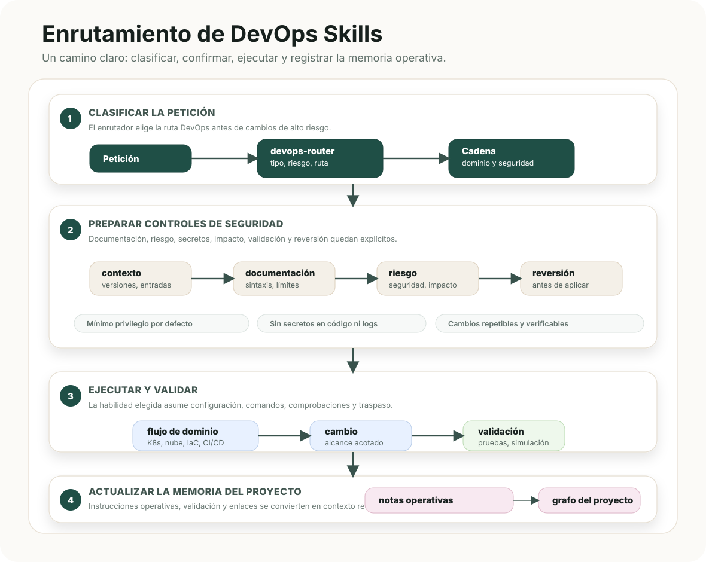

# Guía de DevOps Skills

<p align="center">
  <a href="README.ru.md">🇷🇺 Русский</a>
  &nbsp;·&nbsp; <a href="README.md">🇬🇧 English</a>
  &nbsp;·&nbsp; <strong>🇪🇸 Español</strong>
  &nbsp;·&nbsp; <a href="README.zh.md">🇨🇳 中文</a>
  &nbsp;·&nbsp; <a href="../../README.md">Resumen del repositorio</a>
  &nbsp;·&nbsp; <a href="skills-reference.es.md">Referencia de habilidades</a>
</p>



## Propósito

DevOps Skills reúne contratos de trabajo para agentes que operan infraestructura. Convierte una petición en una secuencia segura: identificar el dominio afectado, consultar documentación vigente, delimitar el cambio, implementarlo o revisarlo, validar el resultado y dejar lo necesario para operarlo o revertirlo.

Funciona con Codex, Claude Code y otros entornos compatibles con MCP. Los nombres de habilidad permanecen en inglés porque son identificadores estables; las guías y los diagramas están localizados.

## Organización

| Parte | Ubicación | Función |
| --- | --- | --- |
| Contrato de habilidad | `devops/skills/<skill>/SKILL.md` | Define rol, entradas iniciales, procedimiento, resultado, calidad y traspaso. |
| Referencia de dominio | `devops/skills/<skill>/references/` | Aporta el flujo reutilizable y las comprobaciones del dominio operativo. |
| Contrato de rutas | `devops/routing/skills.json` | Relaciona señales de petición con propiedad de habilidad, permisos, combinaciones, requisitos y campos de traspaso. |
| Reglas de proyecto | `devops/templates/` | Instala reglas locales concisas para agentes compatibles con Codex y Claude Code. |
| Memoria de proyecto | `devops/obsidian/project-skeleton/` | Guarda notas enlazadas sobre inventario, accesos, despliegues, observabilidad e incidentes. |

`skills.json` es la fuente de verdad para rutas automáticas. La [guía de rutas](../routing/README.es.md) explica el orden de trabajo y la [referencia de habilidades](skills-reference.es.md) describe las 11 habilidades y sus archivos de apoyo.

## Requisitos previos

- Un entorno de agentes compatible con MCP, como Codex o Claude Code.
- Context7 MCP registrado como `context7` o `mcpcontext7`. Es obligatorio antes de generar o revisar detalles de proveedores, plataformas, API, CLI, manifiestos, pipelines, infraestructura como código, contenedores, redes o controles de seguridad.
- Acceso adecuado al proyecto y entorno objetivo para planes, dry-run, validación y aprobaciones.

Context7 proporciona documentación actual; no demuestra el estado actual de la infraestructura. Para eso usa estado del repositorio y proveedor, planes, logs, métricas, trazas y salida de comandos.

## Instalación

Primero revisa el plan de instalación global:

```bash
git clone <repo-url>
cd devops-skills
./install.sh --global --target all --dry-run
```

Instala en todos los destinos compatibles:

```bash
./install.sh --global --target all
```

Para instalar solo en un proyecto:

```bash
./install.sh --local /path/to/project --target all
```

| Opción | Uso |
| --- | --- |
| `--global` | Instala en los directorios de usuario de Codex o Claude Code. |
| `--local PATH` | Añade habilidades y reglas locales sin tocar la configuración global. |
| `--target codex`, `claude`, `agents`, `all` | Selecciona los entornos de agentes; el valor predeterminado es `all`. |
| `--copy` | Copia las carpetas para una instalación portátil. |
| `--link` | Enlaza esta copia durante el desarrollo del paquete. |
| `--force` | Sustituye contenido instalado tras revisar los cambios. |
| `--dry-run` | Muestra acciones previstas sin escribir archivos. |
| `--list` | Lista las habilidades empaquetadas. |

`CODEX_HOME` y `CLAUDE_HOME` pueden reemplazar los directorios globales predeterminados. El instalador no crea ni configura servidores MCP.

## Inicio de una tarea operativa

Para trabajo amplio, describe la tarea con normalidad y deja que `devops-router` la clasifique. Antes de escrituras arriesgadas, el agente debe declarar:

1. Entorno, versión de plataforma, proveedor, región y estado actual.
2. Habilidad o cadena seleccionada y motivo de la elección.
3. Evidencia documental actual de Context7 MCP o de una fuente primaria.
4. Radio de impacto sobre identidades, datos, límites de red, disponibilidad y coste.
5. Orden de validación menos invasivo y la reversión o contención segura más rápida.

Para una tarea delimitada puedes nombrar el dominio: "revisa este plan de Terraform", "prepara un despliegue canary de Kubernetes" o "diagnostica un fallo DNS". El contrato de habilidad y las reglas de seguridad siguen siendo obligatorios.

## Seguridad y decisiones

Aplica el [modelo operativo principal](../routing/principal-operating-model.es.md) antes de implementar, trabajar en producción, modificar controles sensibles o entregar el resultado. Exige hechos separados de supuestos, impacto y reversibilidad explícitos, mínimo privilegio, una escalera de validación, reversión y un traspaso que conserve evidencia y riesgo residual.

El agente pide aprobación antes de operaciones destructivas, cambios en producción, exposición amplia de red, cambios de credenciales, migraciones de datos u operaciones de estado irreversibles.

## Memoria y documentación

El esqueleto de memoria es pequeño a propósito: índice, inventario, acceso y secretos, despliegues, observabilidad e incidentes. Cada nota debe ser breve y estar enlazada desde el índice. No copies credenciales, transcripciones largas ni logs generados.

Consulta la [guía de memoria del proyecto](project-memory.es.md) para conocer la función de cada archivo.

## Mapa de documentación

- [Resumen del repositorio](../../README.md)
- [Referencia de habilidades](skills-reference.es.md)
- [Guía de rutas](../routing/README.es.md)
- [Modelo operativo principal](../routing/principal-operating-model.es.md)
- [Rutas legibles por máquina](../routing/skills.json)
- [Guía de memoria](project-memory.es.md)
- [Esqueleto de memoria](../obsidian/project-skeleton/)
- [Contrato de diseño](../../DESIGN.md)

## Verificación

```bash
python3 devops/scripts/validate.py
sh -n install.sh
./install.sh --global --target all --dry-run
```

El validador revisa contratos de habilidades, rutas, metadatos de Context7, documentación localizada, diagramas, enlaces, instalador y rutas específicas de una máquina.
