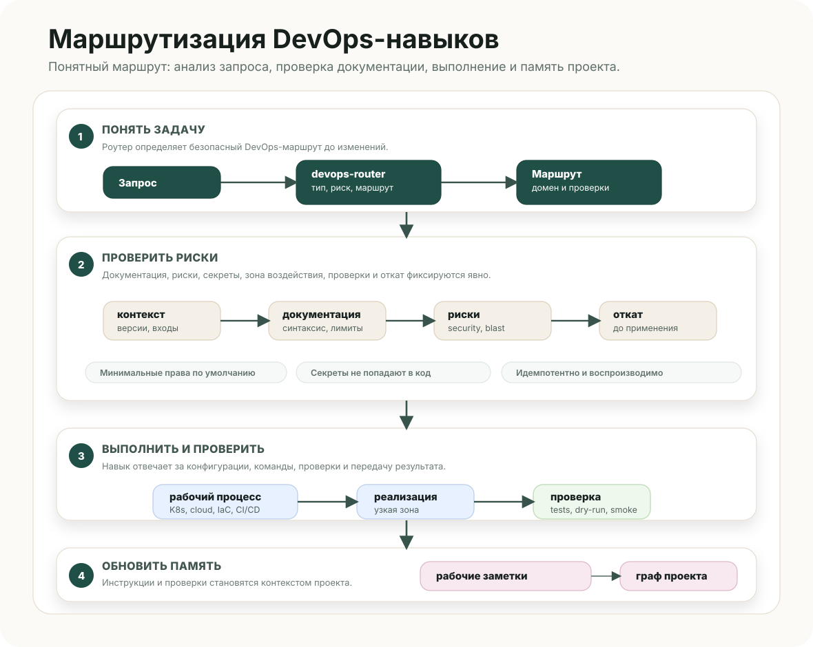

# DevOps Skills

<p align="center">
  <strong>DevOps-навыки для Codex, Claude Code и локальных агентных рабочих процессов.</strong>
</p>

<p align="center">
  <a href="../../README.md">English</a>
  |
  <a href="../routing/README.md">Описание маршрутизации</a>
  |
  <a href="project-memory.md">Память проекта</a>
</p>

<p align="center">
  🛡️ контроль безопасности · 🧭 явная маршрутизация · ⚙️ инфраструктурные процессы · ✅ проверка и откат
</p>

---

## Обзор

DevOps Skills превращает DevOps-задачу в понятный маршрут для агента: сначала анализ запроса, затем проверка актуальной документации, выбор доменного навыка, реализация в понятной зоне воздействия, валидация и аккуратная передача результата.

Вся рабочая система лежит в одном основном каталоге: [`devops/`](..).

## Схема маршрутизации



## Быстрый старт

```bash
git clone <repo-url>
cd devops-skills
./install.sh --list
./install.sh --global --target all --dry-run
python3 devops/scripts/validate.py
```

Глобальная установка для Codex:

```bash
./install.sh --global --target codex --force
```

Глобальная установка для Claude Code:

```bash
./install.sh --global --target claude --force
```

Установка в конкретный проект:

```bash
./install.sh --local /path/to/project --target all --force
```

## Навыки

| Навык | За что отвечает |
| --- | --- |
| `devops-router` | Принимает широкие DevOps-запросы, выбирает цепочку навыков и держит обязательные контрольные проверки качества. |
| `kubernetes-operations` | Kubernetes, Helm, Kustomize, манифесты, стратегия выката, probes, RBAC, NetworkPolicy, хранилища и диагностика кластера. |
| `cloud-operations` | Облака, IAM, VPC/VNet, регионы, управляемые сервисы, HA/DR, миграции, контроль стоимости и рисков. |
| `observability-operations` | Метрики, логи, трассировка, панели мониторинга, alerting, SLI/SLO и production-диагностика. |
| `cicd-automation` | CI/CD, build/test/scan/package/deploy, подтверждения, защищённые окружения, шаблоны релиза и откат. |
| `scripting-automation` | Bash, Python, PowerShell, CLI-хелперы, диагностика, миграции, пробный запуск и безопасная обработка ошибок. |
| `infrastructure-as-code` | Terraform, OpenTofu, Pulumi, CloudFormation, Bicep, ARM, Crossplane, state, imports и разбор плана изменений. |
| `container-platforms` | Docker, BuildKit, Podman, Compose, OCI images, registry, healthcheck, non-root runtime и безопасность образов. |
| `security-secrets` | Управление секретами, Vault/KMS/SOPS/Sealed Secrets, усиление IAM/RBAC, сканирование, SBOM, подпись артефактов, аудит и ротация. |
| `incident-troubleshooting` | Инциденты, деградации, неудачные деплои, временная шкала, гипотезы, восстановление, откат и профилактика. |
| `network-vpn-security` | Сети, VPN, маршрутизация, DNS, firewall, ACL, security groups, частная связность, гибридные сети и MTU/latency. |

## Как работает маршрутизация

1. `devops-router` определяет тип задачи и риск.
2. Роутер выбирает один или несколько доменных навыков.
3. Перед генерацией платформенных конфигураций агент сверяет актуальную документацию.
4. Реализация идёт только в рамках выбранного домена и понятной зоны воздействия.
5. В конце агент даёт проверки, риски, план отката и допущения.

## Проверка

```bash
python3 devops/scripts/validate.py
sh -n install.sh
./install.sh --global --target all --dry-run
```

Если эти команды проходят, структура навыков, маршрутизация, ссылки, схемы и установщик находятся в рабочем состоянии.
