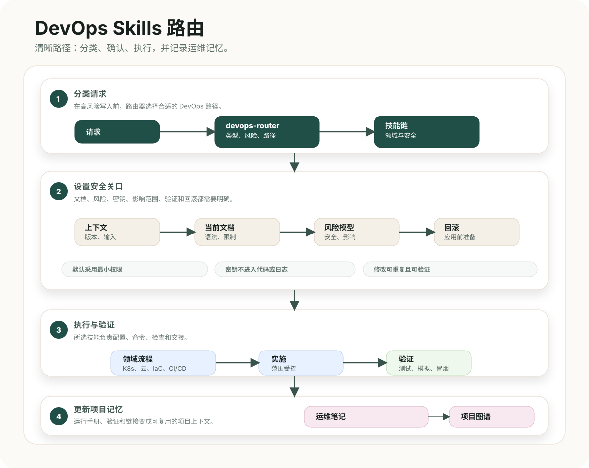

# DevOps Skills 指南

<p align="center">
  <a href="README.ru.md">🇷🇺 Русский</a>
  &nbsp;·&nbsp; <a href="README.md">🇬🇧 English</a>
  &nbsp;·&nbsp; <a href="README.es.md">🇪🇸 Español</a>
  &nbsp;·&nbsp; <strong>🇨🇳 中文</strong>
  &nbsp;·&nbsp; <a href="../../README.md">仓库概览</a>
  &nbsp;·&nbsp; <a href="skills-reference.zh.md">技能参考</a>
</p>



## 用途

DevOps Skills 为操作基础设施的代理提供工作契约。它将请求变成安全顺序：识别受影响领域、查询最新文档、划定修改边界、实施或审查变更、验证结果，并留下运行或回滚所需的信息。

它支持 Codex、Claude Code 和其他兼容 MCP 的代理环境。技能名称保留英文，因为它们是稳定标识符；指南和图表提供本地化版本。

## 组成

| 部分 | 位置 | 作用 |
| --- | --- | --- |
| 技能契约 | `devops/skills/<skill>/SKILL.md` | 定义角色、起始输入、步骤、结果、质量要求和交接。 |
| 领域参考资料 | `devops/skills/<skill>/references/` | 提供该运维领域可复用的工作流程与检查项。 |
| 路由契约 | `devops/routing/skills.json` | 将请求信号映射到技能归属、权限、组合、前置条件和交接字段。 |
| 项目规则 | `devops/templates/` | 为兼容 Codex 的代理和 Claude Code 安装简明本地规则。 |
| 项目记忆 | `devops/obsidian/project-skeleton/` | 保存关于清单、访问、部署、可观测性和事件的简短关联笔记。 |

`skills.json` 是自动路由的事实来源。[路由指南](../routing/README.zh.md)说明工作顺序，[技能参考](skills-reference.zh.md)介绍全部 11 项技能及其参考文件。

## 前置条件

- 兼容 MCP 的代理环境，例如 Codex 或 Claude Code。
- 注册为 `context7` 或 `mcpcontext7` 的 Context7 MCP。生成或审查提供商、平台、API、CLI、清单、流水线、基础设施即代码、容器、网络或安全控制细节前必须使用它。
- 对目标项目和环境具有执行计划、dry-run、验证及审批步骤所需的访问权限。

Context7 提供最新文档，但不能证明基础设施当前状态。当前状态应由仓库与提供商状态、计划、日志、指标、追踪和命令输出证明。

## 安装

先预览全局安装计划：

```bash
git clone <repo-url>
cd devops-skills
./install.sh --global --target all --dry-run
```

安装到所有支持的目标：

```bash
./install.sh --global --target all
```

只安装到一个项目时：

```bash
./install.sh --local /path/to/project --target all
```

| 选项 | 用途 |
| --- | --- |
| `--global` | 安装到 Codex 或 Claude Code 的用户目录。 |
| `--local PATH` | 安装项目本地技能和规则，不修改全局配置。 |
| `--target codex`、`claude`、`agents`、`all` | 选择代理环境；默认值为 `all`。 |
| `--copy` | 复制目录，适合可移植安装。 |
| `--link` | 开发技能包时链接到本仓库。 |
| `--force` | 检查变更后替换已安装内容。 |
| `--dry-run` | 仅显示计划操作，不写入文件。 |
| `--list` | 列出打包的技能。 |

`CODEX_HOME` 和 `CLAUDE_HOME` 可覆盖默认全局目录。安装程序不会创建或配置 MCP 服务器。

## 开始运维任务

对于范围较大的工作，用自然语言描述任务，让 `devops-router` 进行分类。进行有风险的写入前，代理必须明确说明：

1. 目标环境、平台版本、提供商、区域和当前状态。
2. 所选技能或技能链，以及选择理由。
3. 来自 Context7 MCP 或一手来源的当前文档证据。
4. 对身份、数据、网络边界、可用性和成本的影响范围。
5. 最低侵入性的验证顺序，以及最快的安全回滚或隔离动作。

对于范围明确的任务，可直接说明领域，例如“审查此 Terraform 计划”“准备 Kubernetes 金丝雀发布”或“诊断 DNS 故障”。技能契约和安全规则仍然适用。

## 安全与决策

在实施、影响生产环境的工作、敏感安全变更或最终交接前，应用[高级工程运行模型](../routing/principal-operating-model.zh.md)。它要求将事实与假设分开、明确影响与可逆性、使用最小权限、按验证阶梯执行、有回滚方案，并在交接中保留证据和剩余风险。

执行破坏性操作、生产变更、广泛网络暴露、凭据变更、数据迁移或不可逆状态操作前，代理必须请求批准。

## 项目记忆与文档

项目记忆骨架刻意保持简洁：索引、清单、访问与密钥、部署、可观测性和事件。每条笔记应短小，并从索引链接。不要写入实时凭据、冗长命令记录或生成日志。

请阅读[项目记忆指南](project-memory.zh.md)了解每个文件的用途。

## 文档地图

- [仓库概览](../../README.md)
- [技能参考](skills-reference.zh.md)
- [路由指南](../routing/README.zh.md)
- [高级工程运行模型](../routing/principal-operating-model.zh.md)
- [机器可读路由](../routing/skills.json)
- [项目记忆指南](project-memory.zh.md)
- [项目记忆骨架](../obsidian/project-skeleton/)
- [文档设计契约](../../DESIGN.md)

## 验证

```bash
python3 devops/scripts/validate.py
sh -n install.sh
./install.sh --global --target all --dry-run
```

验证程序会检查技能契约、路由、Context7 元数据、本地化文档、图表、链接、安装程序和机器特定路径。
